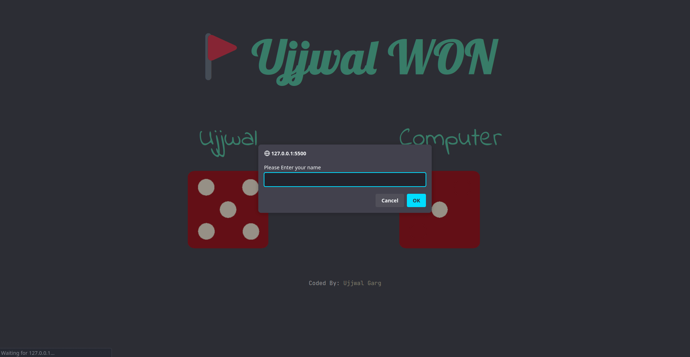
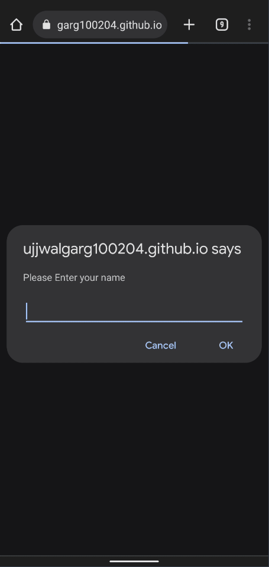

<!-- Project Shields -->

  
  
  
  

<!-- Project Logo -->
 

  

<h3 align="center">DiceSim using JS</h3>

  

Immerse yourself in the thrill of dice rolling with DiceSim, a responsive website powered by Tailwind CSS and Vanilla JavaScript.
     
    <a
      href="https://gargujjwal.github.io/Vanilla-JS-Dice-Throw/"
      aria-label="Link to go to the demo of the project"
      >View Demo</a
    >
    .
    <a
      href="https://github.com/gargujjwal/Vanilla-JS-Dice-Throw/issues"
      aria-label="Link to issues of github repo"
      >Report Bug</a
    >
    ·
    <a
      href="https://github.com/gargujjwal/Vanilla-JS-Dice-Throw/issues"
      aria-label="Link to issues of github repo"
      >Request Feature</a
    >
  

<!-- TABLE OF CONTENTS -->

  
Table of Contents

  <ol>
    <li>
      <a href="#about-the-project">About The Project</a>
      <ul>
        <li><a href="#built-with">Built With</a></li>
      </ul>
    </li>
    <li><a href="#contributing">Contributing</a></li>
    <li><a href="#license">License</a></li>
    <li><a href="#author">Author</a></li>
    <li><a href="#acknowledgments">Acknowledgments</a></li>
  </ol>

<!-- ABOUT THE PROJECT -->
<h2>About The Project</h2>
Experience the excitement of rolling the dice anytime, anywhere with DiceSim. This responsive website combines the power of Tailwind CSS and Vanilla JavaScript to bring you an immersive dice throwing simulation. With realistic animations and customizable settings, DiceSim offers a virtual dice rolling experience that is engaging and enjoyable for players of all ages.

#### Desktop Design

  

#### Mobile Design

 

(<a href="#readme-top">back to top</a>)

<!-- Built With -->

### Built With

<ul>
  <li>
    
  </li>
  <li>
    
  </li>
  <li>
    
  </li>
</ul>

(<a href="#readme-top">back to top</a>)

<!-- CONTRIBUTING -->

## Contributing

Contributions are what make the open source community such an amazing place to learn, inspire, and create. Any
contributions you make are **greatly appreciated**.

If you have a suggestion that would make this better, please fork the repo and create a pull request. You can also
simply open an issue with the tag "enhancement".
Don't forget to give the project a star! Thanks again!

1. Fork the Project
2. Create your Feature Branch (`git checkout -b feature/AmazingFeature`)
3. Commit your Changes (`git commit -m 'Add some AmazingFeature'`)
4. Push to the Branch (`git push origin feature/AmazingFeature`)
5. Open a Pull Request

(<a href="#readme-top">back to top</a>)

<!-- LICENSE -->

## License

Distributed under the MIT License. See `LICENSE` for more information.

(<a href="#readme-top">back to top</a>)

<!-- CONTACT -->

## Author

- Website - [Ujjwal Garg](https://github.com/gargujjwal)
- Instagram - [@gargujjwal](https://www.instagram.com/gargujjwal/)
- Linkedin - [@gargujjwal](https://www.linkedin.com/in/gargujjwal04/)
- Twitter -[@UjwalGarg100204](https://twitter.com/UjwalGarg100204)

(<a href="#readme-top">back to top</a>)

